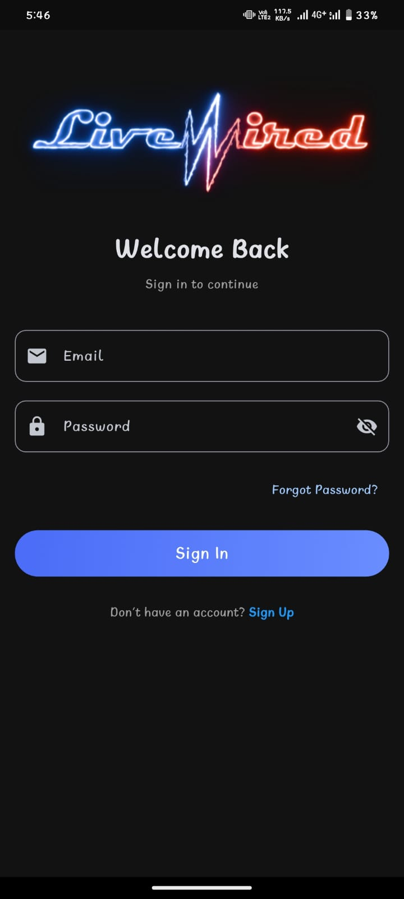

# SP: `login`

**Endpoint:** `POST /rpc/login`
**Group:** Auth
**Description:** Authenticates a user with email and password. Returns user ID and email on success. Uses `SECURITY DEFINER`.

## App Screen



> Save screenshot as: `docs/assets/screenshots/login.png`

---

## Parameters

| Param | Type | Required | Notes |
|-------|------|----------|-------|
| email | text | Yes | Must match exactly (case-sensitive) |
| password | text | Yes | Plain text compared directly |

---

## Request Example

```json
{
  "email": "harshil@gmail.com",
  "password": "mypassword123"
}
```

---

## Response

### Success
```json
{
  "status": true,
  "user_id": 1,
  "email": "harshil@gmail.com",
  "message": "Login successful"
}
```

### Fail — Email required
```json
{
  "status": false,
  "message": "Email is required"
}
```

### Fail — Password required
```json
{
  "status": false,
  "message": "Password is required"
}
```

### Fail — Wrong credentials
```json
{
  "status": false,
  "message": "Invalid email or password"
}
```

---

## Error Cases

| Scenario | Response |
|----------|----------|
| Email is null or empty | `"Email is required"` |
| Password is null or empty | `"Password is required"` |
| Email not found in `users` | `"Invalid email or password"` |
| Password does not match | `"Invalid email or password"` |

> ℹ️ Both "user not found" and "wrong password" return the same message intentionally — prevents user enumeration attacks.

---

## Logic Flow

1. Validate email not null/empty
2. Validate password not null/empty
3. SELECT `id, email, password` FROM `users` WHERE `email = login.email` LIMIT 1
4. If no row → `"Invalid email or password"`
5. If `v_user.password <> login.password` → `"Invalid email or password"`
6. Return `user_id`, `email`, success message

---

## Notes

- Email match is **case-sensitive** (exact string match, no `lower()`)
- Password comparison is **plain text** — no bcrypt/hashing in this SP
- Does not return `is_creator` in response — call `GET /users?id=eq.<user_id>` or check separately if needed

---

## SQL Reference

See [`functions/auth/login.md`](../../../functions/auth/login.md)
